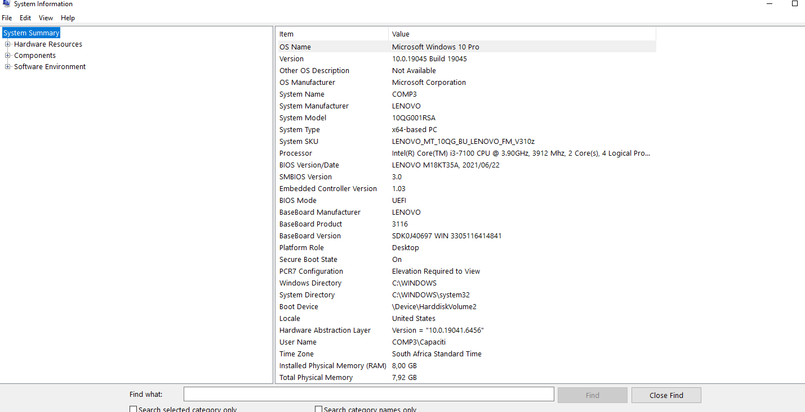
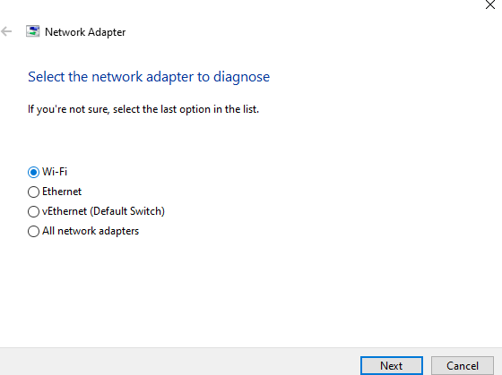
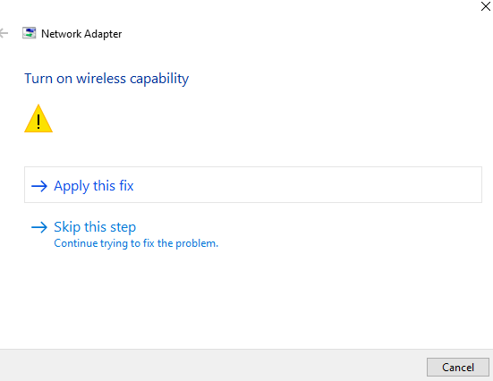
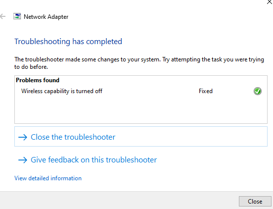
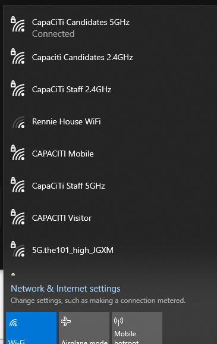

Troubleshooting Guide: Airplane Mode & Wireless Connectivity
 Overview
This document provides a tiered troubleshooting approach for devices stuck in Airplane Mode or experiencing "ghost" wireless toggles where Wi-Fi and Bluetooth cannot be re-enabled.

 Tier 1: Quick Fixes (The "Low Hanging Fruit")
Before diving into drivers, always check the physical and simple software toggles:

Keyboard Shortcuts: Look for a function key with an airplane icon (e.g., Fn + F2 or F12).

Action Center/Control Center: Ensure the toggle isn't just "stuck" in the UI. Try toggling it On, waiting 5 seconds, then Off.

Physical Switches: Some older laptops (Dell Latitude, HP EliteBooks) have a physical slider switch on the side or front of the chassis.

 Tier 2: Software & OS Configuration
If the UI toggle is greyed out, the OS might be preventing the change.

1. Power Management Settings
Windows often "sleeps" the wireless card to save power and forgets to wake it up.

Open Device Manager.

Right-click your Wireless Network Adapter > Properties.

Go to Power Management.

Uncheck "Allow the computer to turn off this device to save power."

2. Radio Management Service (Windows)
Press Win + R, type services.msc.

Locate Radio Management Service.

Ensure it is set to Automatic and is currently Running.

 Tier 3: Driver & Hardware Reset
If the software layer is unresponsive, the issue is likely communication between the OS and the hardware.

1. The "Clean" Reinstall
Uninstall: In Device Manager, right-click the Wi-Fi adapter and select Uninstall Device (do not delete driver software yet).

Scan: Click Action > Scan for hardware changes to force the OS to re-recognize the chip.

2. BIOS/UEFI Check
Sometimes a BIOS update or a "Secure Boot" glitch can disable the wireless radio at a hardware level.

Restart and enter BIOS.

Navigate to Wireless / Network Configuration.

Ensure "Wireless LAN" and "Bluetooth" are enabled.

 Escalation Path
 
 
 
 
 
 
 
If the following conditions are met, escalate to Hardware Repair:

Wi-Fi adapter is not visible in Device Manager (even under "Hidden Devices").

A "Clean Boot" of the OS does not resolve the greyed-out toggle.

The device has recently suffered an impact or liquid spill.
